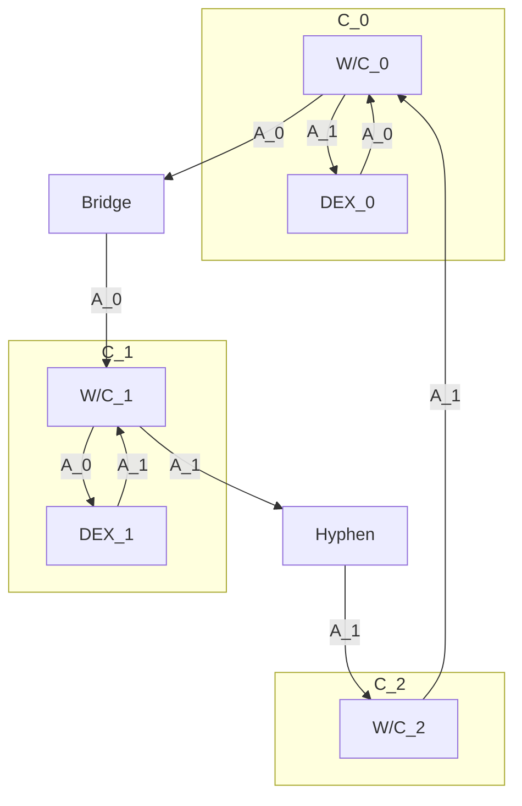

# Hyphen Arbitrage

## The path
When the bridge is imbalanced for asset $$A_1$$, with chain $$C_1$$ being in deficit and chain $$C_2$$ being in surplus, we will want to bridge from chain $$C_1$$ to chain $$C_2$$.
The choice of chain $$C_1$$ and $$C_2$$ is such that $$C_1$$ is the most in-deficit chain and $$C_2$$ the most in-surplus chain so that we maximise the incentive reward received.

Assuming the funds are stored in asset $$A_0$$ on a wallet $$W$$ on chain $$C_0$$, we will need to:
- swap $$A_0$$ for $$A_1$$, if $$A_0 \neq A_1$$
- bridge from $$C_0$$ to $$C_1$$ (not via Hyphen), if $$C_0 \neq C_1$$ 
- bridge $$A_1$$ from $$C_1$$ to $$C_2$$ via Hyphen
- bridge back $$A_1$$ from $$C_2$$ to $$C_0$$
- potentially swap back $$A_1$$ for $$A_0$$ if $$A_1$$ is not a stable

Note that the first 2 steps are invertible.

A few edge cases:
- If $$C_2$$ = BSC, we can use the Binance deposit address in the bridge to get back the asset and then withdraw to $C_0$ for a fee of 9.6bps  